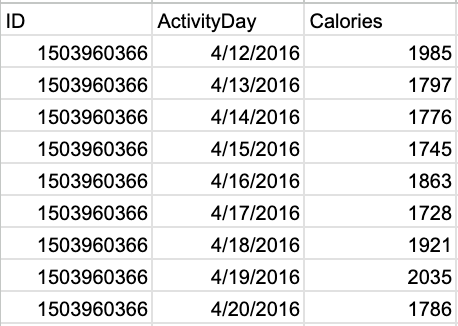
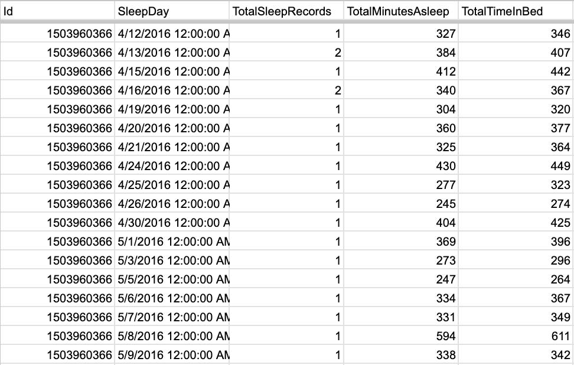

## Introduction

Bellabeat is a high-tech company that manufactures health-focused smart products designed for women. Founded by Urška Sršen and Sando Mur, Bellabeat has quickly positioned itself as a tech-driven wellness company. The company's product line includes the Bellabeat app, Leaf wellness tracker, Time watch, and Spring water bottle. These products collect data on activity, sleep, stress, and reproductive health, empowering women with knowledge about their own health and habits. Bellabeat has expanded rapidly since its inception in 2013 and has invested in a variety of marketing channels, including digital marketing and traditional advertising.

## Ask

Bellabeat aims to enhance its market position by leveraging data analysis to understand smart device usage trends. The primary objective of this analysis is to discover actionable insights that can inform and optimize the company's marketing strategy. By examining data from non-Bellabeat smart devices, the analysis will focus on identifying trends in consumer behavior. The findings will help Bellabeat tailor its marketing efforts, improve product offerings, and ultimately drive business growth.

### Deliverables
- A clear summary of the business task
- A description of all data sources used
- Documentation of any cleaning or manipulation of data
- A summary of the analysis
- Supporting visualizations and key findings
- High-level recommendations based on the analysis

### Prepare

For this case study, I utilized data from the "FitBit Fitness Tracker Data" available on Kaggle. Specifically, I used the following datasets:

## **dailyCalories_merged.csv**

## **dailySteps_merged.csv**

## **sleepDay_merged.csv**

You can download the dataset from Kaggle here: <https://www.kaggle.com/datasets/arashnic/fitbit?resource=download>

**Data Preparation Steps:**

1. **Data Integration:** 
   - Combined the data from the three CSV files to analyze various aspects of user activity and health metrics. This involved aligning the datasets based on common identifiers such as User ID and Date.

2. **Data Cleaning:**
   - Addressed any missing or inconsistent data points to ensure accuracy in the analysis. This included:
     - Removing or correcting erroneous entries.
     - Ensuring that date and time formats were standardized across all datasets.

3. **Data Transformation:**
   - Prepared the data for analysis by:
     - Aggregating daily steps and sleep data to calculate average values.
     - Segmenting data by time of day to observe patterns in activity levels.
     - Calculating relationships between different metrics.

**Visualizations Prepared:**

1. **Relationship Between Average Daily Steps and Average Sleep Duration:**
   - Created a table to examine how daily steps correlate with sleep duration, providing insights into whether increased physical activity impacts sleep quality.

2. **Average Daily Steps Based on Time of Day:**
   - Developed a table to visualize how steps taken vary throughout different times of the day, helping to identify peak activity periods.

3. **Relationship Between Average Calories Burned and Average Sleep Time:**
   - Constructed a table to analyze how the number of calories burned correlates with sleep duration, offering insights into potential health benefits associated with caloric expenditure.

These visualizations were designed to uncover actionable insights that can inform Bellabeat’s marketing strategy and enhance their understanding of user behavior with their smart devices.

## Process

To analyze the Fitbit Fitness Tracker Data, I followed a structured approach that involved data cleaning, integration, and visualization:

1. **Data Cleaning:**
   - During the initial data exploration, I identified scenarios such as extreme outliers, including instances of invalid data. For example, one entry showed an individual with only 57 minutes of sleep in a day, which was identified as an outlier and excluded from the analysis.
   - I ensured that all datasets had consistent formatting, particularly in the case of date and time entries, which were standardized across the data.

2. **Tools Used:**
   - I selected spreadsheets and Tableau for this project. These tools provided the flexibility and visualization capabilities needed to handle the dataset effectively.

3. **Data Integration:**
   - The analysis required combining data from three different datasets: 
     - **dailyCalories_merged.csv**
     - **dailySteps_merged.csv**
     - **sleepDay_merged.csv**
   - Using spreadsheets, I merged these datasets based on User ID and Date, creating a comprehensive dataset that included information on daily steps, calories burned, and sleep duration.

4. **Pivot Tables and Visualizations:**
   - I created pivot tables to facilitate the analysis of various relationships:
     
### **Average Daily Steps and Average Sleep Duration per User:**
       
| ID           | Average Steps per Day | Average Sleep per Day (Minutes) |
|--------------|-----------------------|----------------------------------|
| 1503960366   | 12117                 | 360                              |
| 1644430081   | 7283                  | 294                              |
| 1844505072   | 2580                  | 652                              |
| 1927972279   | 916                   | 417                              |
| 2026352035   | 5567                  | 506                              |
| 2320127002   | 4717                  | 61                               |
| 2347167796   | 9520                  | 447                              |
| 3977333714   | 10985                 | 294                              |
| 4020332650   | 2267                  | 349                              |
| 4319703577   | 7269                  | 477                              |
| 4388161847   | 10814                 | 403                              |
| 4445114986   | 4797                  | 385                              |
| 4558609924   | 7685                  | 128                              |
| 4702921684   | 8572                  | 421                              |
| 5553957443   | 8613                  | 463                              |
| 5577150313   | 8304                  | 432                              |
| 6117666160   | 7047                  | 479                              |
| 6775888955   | 2520                  | 350                              |
| 6962181067   | 9795                  | 448                              |
| 7007744171   | 11323                 | 69                               |
| 7086361926   | 9372                  | 453                              |
| 8053475328   | 14763                 | 297                              |
| 8378563200   | 8718                  | 443                              |
| 8792009665   | 1854                  | 436                              |

   - This table explored the correlation between the number of steps taken daily and the amount of sleep recorded, providing insights into how physical activity might influence sleep patterns.
     
### **Average Daily Steps Based on Time of Day:**
    
| Time of Day  | Average Total Steps |
|--------------|---------------------|
| 12AM - 4AM   | 22                  |
| 4AM - 8AM    | 135                 |
| 8AM - 12PM   | 450                 |
| 12PM - 4PM   | 508                 |
| 4PM - 8PM    | 557                 |
| 8PM - 12AM   | 256                 |

 - This table identified trends in activity levels at different times, highlighting peak periods of physical activity.
   
### **Average Calories Burned and Average Sleep Time per User:**
    
| ID          | Average Calories | Average Sleep |
|-------------|------------------|---------------|
| 1503960366  | 1816             | 348           |
| 1644430081  | 2811             | 352           |
| 1844505072  | 1573             | 683           |
| 1927972279  | 2173             | 464           |
| 2026352035  | 1541             | 506           |
| 2320127002  | 1724             | 61            |
| 2347167796  | 2043             | 447           |
| 3977333714  | 1514             | 294           |
| 4020332650  | 2386             | 349           |
| 4319703577  | 2038             | 477           |
| 4388161847  | 3094             | 403           |
| 4445114986  | 2186             | 385           |
| 4558609924  | 2033             | 128           |
| 4702921684  | 2966             | 421           |
| 5553957443  | 1876             | 463           |
| 5577150313  | 3360             | 432           |
| 6117666160  | 2261             | 479           |
| 6775888955  | 2132             | 350           |
| 6962181067  | 1982             | 448           |
| 7007744171  | 2544             | 69            |
| 7086361926  | 2566             | 453           |
| 8053475328  | 2946             | 297           |
| 8378563200  | 3437             | 443           |
| 8792009665  | 1962             | 436           |

   - This table examined how the number of calories burned correlates with sleep duration, offering potential insights into the relationship between caloric expenditure and sleep quality.

5. **Data Verification:**
   - After creating the pivot tables and visualizations, I verified the accuracy and relevance of the data. This step ensured that the analysis was based on valid and reliable data points.

6. **Analysis:**
   - With the clean, combined data and visualizations, I began analyzing the identified relationships. The analysis focused on extracting actionable insights that could inform Bellabeat's marketing strategies and provide a deeper understanding of how users interact with their devices.
